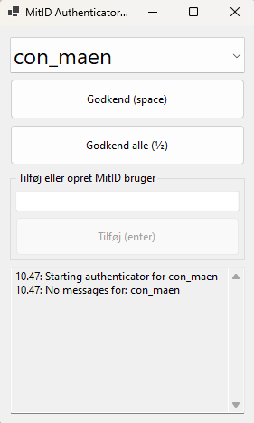

# MitID Authenticator 4000

## Use Case

This tool is a practical alternative to navigating [MitID's test tool](https://pp.mitid.dk/test-tool/frontend/#/view-identity) by providing UI with keybindings for faster and more efficient interaction, as well as a neat way to organize testusers

## How to run an executable.

A zipped package of the build is included in this repo for your convienience. 

1. Extract zip in your personal tools folder
2. (opt.) Add the .exe to your taskbar.
3. Run the executable

## How to Use

Upon opening the app, the pending login attempts first user is queried and potentially validated.

Use the drop down and buttons (or their keybindings) to authenticate users.
Users are saved in a text document.

### Create new individual
To create a new individual simply enter a name in the input field and press enter.

If the identifier already exist, it's identifier and ID is simply added to the stored document
If the identifier doesn't exist a new individual is created with mock data
If the identifier is missing a simulator, a new one is added.

### Notes
Ease of use can be improved by adding the app to the task bar in e.g. the 10'th slot. This way the first user in the list is authenticated when you press "⊞ + 0"

The lines of the accompanying text document can be edited to change the order or remove the registered individuals.

## Honorable Mentions

This app is a fork of a console application first developed by Christian Mørup (cmo). 

## Notes

Include any additional information that users should know about your project. This could be about known bugs, future plans for the project, or usage tips.

- Using an app with keybindings allows users to perform actions quickly and efficiently without the need to navigate through multiple webpages and click around.
- Keybindings provide a more streamlined and intuitive user experience, especially for power users who prefer keyboard shortcuts over mouse interactions.
- With keybindings, users can perform complex tasks with just a few keystrokes, saving time and effort.
- Keybindings also enable automation and scripting capabilities, allowing users to create custom workflows and automate repetitive tasks.

